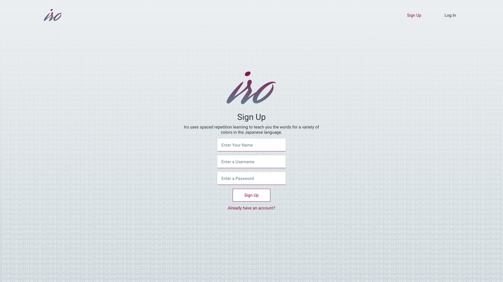
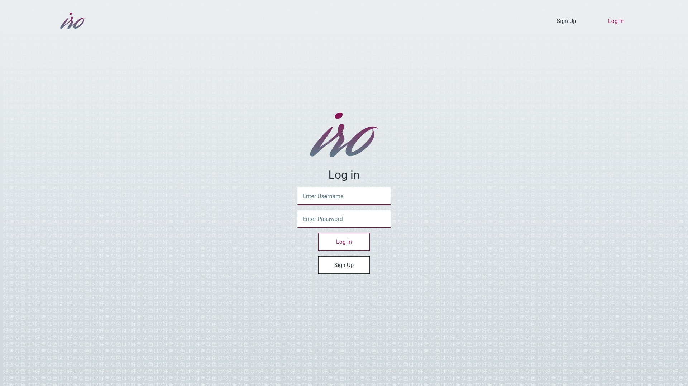
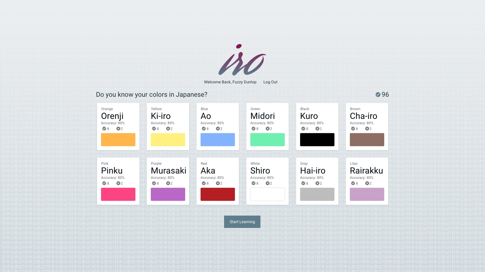

# Iro









By George Brown, Matt Patterson and Josh Struve.

## Technology

PERN stack
 - `PostgreSQL`
 - `Express.js`
 - `React.js`
 - `Node.js`
 
### Endpoints

Supported endpoints: 
 - `/auth/token`
 - `/language`
 - `/language/head`
 - `/language/guess`
 - `/user`
 
#### Sample Requests/Responses

`/auth/token`
  - Method: `/POST`
  - Request Params:
     - passwords must include at least 1 upper and lower case letter, 1 special character and 1 number
   ```javascript
   {
      "username": "Marco Amigo",
      "password": "Marco_password1"
   }
   ```
   - Response
      - `200`
      ```javascript
      {
         "authToken": "jwt generated bearer token"
      }
      ```
      - `400`
      ```javascript
      {
          "error": 'Incorrect username or password',
      }
      ```
`/language`
   - Method: `/GET`
   - Request Params: user and language database id
   - Response
      - `200`
      ```javascript
      {
          "language": {
           "id": 2,
           "name": "Japanese",
           "user_id": 2,
           "head": 13,
           "total_score": 0
         },
         "words": [
           {
            "id": 13,
            "language_id": 2,
            "original": "Orange",
            "translation": "Orenji",
            "next": 14,
            "memory_value": 1,
            "correct_count": 0,
            "incorrect_count": 0,
            "hex": "#FFB74D",
            "script": "orange.svg"
        },
        // ...
       }
      ```

## Configuring Postgres

For tests involving time to run properly, configure your Postgres database to run in the UTC timezone.

1. Locate the `postgresql.conf` file for your Postgres installation.
   1. E.g. for an OS X, Homebrew install: `/usr/local/var/postgres/postgresql.conf`
   2. E.g. on Windows, _maybe_: `C:\Program Files\PostgreSQL\11.2\data\postgresql.conf`
   3. E.g  on Ubuntu 18.04 probably: '/etc/postgresql/10/main/postgresql.conf'
2. Find the `timezone` line and set it to `UTC`:

```conf
# - Locale and Formatting -

datestyle = 'iso, mdy'
#intervalstyle = 'postgres'
timezone = 'UTC'
#timezone_abbreviations = 'Default'     # Select the set of available time zone
```

## Scripts

Start the application `npm start`

Start nodemon for the application `npm run dev`

Run the tests mode `npm test`

Run the migrations up `npm run migrate`

Run the migrations down `npm run migrate -- 0`
